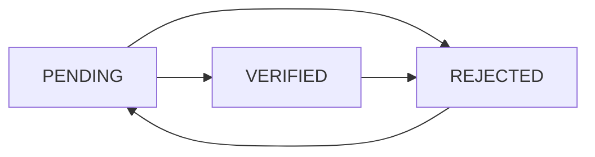

# ✅ Bank Account Verification Feature - Backend Implementation

## 📋 Tổng Quan

Feature xác minh ngân hàng cho Admin đã được implement hoàn chỉnh, cho phép Admin:

- ✅ Xem danh sách tất cả tài khoản ngân hàng
- ✅ Xem chi tiết từng tài khoản ngân hàng
- ✅ Xác minh (verify) tài khoản ngân hàng
- ✅ Từ chối (reject) tài khoản ngân hàng
- ✅ Cập nhật trạng thái tài khoản ngân hàng

---

## 🗂️ Files Đã Tạo/Sửa

### 1. **User Model** (`src/models/User.js`)

**Đã cập nhật:**

- Thêm các fields mới vào `bankAccount`:
  - `verifiedAt`: Date - Thời gian xác minh
  - `rejectedAt`: Date - Thời gian từ chối
  - `adminNote`: String - Ghi chú của admin khi verify
  - `rejectionReason`: String - Lý do từ chối

```javascript
bankAccount: {
  bankCode: String,
  bankName: String,
  accountNumber: String,
  accountHolderName: String,
  status: String,           // PENDING | VERIFIED | REJECTED
  isVerified: Boolean,
  addedAt: Date,
  verifiedAt: Date,         // ✨ NEW
  rejectedAt: Date,         // ✨ NEW
  adminNote: String,        // ✨ NEW
  rejectionReason: String   // ✨ NEW
}
```

---

### 2. **Admin Service** (`src/services/admin.service.js`)

**Đã thêm 5 methods mới:**

#### `getAllBankAccounts(filters)`

- Lấy danh sách tất cả tài khoản ngân hàng với pagination
- Hỗ trợ filter theo: `status`, `bankCode`
- Hỗ trợ search theo: số tài khoản, tên chủ TK, email
- Trả về statistics: total, pending, verified, rejected

#### `getBankAccountById(userId)`

- Lấy chi tiết tài khoản ngân hàng của một user
- Bao gồm thông tin: profile, verification status, CCCD

#### `verifyBankAccount(userId, adminNote)`

- Xác minh tài khoản ngân hàng
- Cập nhật status = 'VERIFIED', isVerified = true
- Lưu thời gian verify và admin note

#### `rejectBankAccount(userId, rejectionReason)`

- Từ chối xác minh tài khoản ngân hàng
- Cập nhật status = 'REJECTED', isVerified = false
- Lưu thời gian reject và lý do từ chối

#### `updateBankAccountStatus(userId, status, note)`

- Cập nhật trạng thái tổng quát
- Hỗ trợ chuyển đổi giữa các status: PENDING, VERIFIED, REJECTED

---

### 3. **Admin Controller** (`src/controllers/admin.controller.js`)

**Đã thêm 5 controller methods:**

#### `getAllBankAccounts(req, res)`

- Handle GET request với query params
- Trả về danh sách + pagination + stats

#### `getBankAccountById(req, res)`

- Handle GET request với userId param
- Trả về chi tiết user + bank account

#### `verifyBankAccount(req, res)`

- Handle PATCH request để verify
- Nhận adminNote từ body

#### `rejectBankAccount(req, res)`

- Handle PATCH request để reject
- Nhận rejectionReason từ body (required)

#### `updateBankAccountStatus(req, res)`

- Handle PATCH request để update status
- Nhận status và note từ body

---

### 4. **Admin Routes** (`src/routes/admin.routes.js`)

**Đã thêm 5 routes mới:**

```javascript
// GET /api/admin/bank-accounts - List all bank accounts
router.get('/bank-accounts', adminController.getAllBankAccounts);

// GET /api/admin/bank-accounts/:userId - Get bank account detail
router.get('/bank-accounts/:userId', adminController.getBankAccountById);

// PATCH /api/admin/bank-accounts/:userId/verify - Verify bank account
router.patch('/bank-accounts/:userId/verify', adminController.verifyBankAccount);

// PATCH /api/admin/bank-accounts/:userId/reject - Reject bank account
router.patch('/bank-accounts/:userId/reject', adminController.rejectBankAccount);

// PATCH /api/admin/bank-accounts/:userId/status - Update status
router.patch('/bank-accounts/:userId/status', adminController.updateBankAccountStatus);
```

**🔒 Security:**

- Tất cả routes yêu cầu authentication: `authMiddleware.verifyToken`
- Yêu cầu role ADMIN: `requireRole('ADMIN')`

---

### 5. **API Documentation** (`docs/BANK_ACCOUNT_VERIFICATION_API.md`)

**Tài liệu API hoàn chỉnh:**

- Chi tiết tất cả endpoints
- Request/Response examples
- Error codes và handling
- cURL examples
- Database schema

---

## 🎯 Features Chi Tiết

### 1. Danh Sách Tài Khoản Ngân Hàng

**Endpoint:** `GET /api/admin/bank-accounts`

**Query Parameters:**

- `page`: Số trang (default: 1)
- `limit`: Items per page (default: 10)
- `search`: Tìm kiếm theo số TK, tên chủ TK, email
- `status`: Filter theo PENDING/VERIFIED/REJECTED
- `bankCode`: Filter theo mã ngân hàng (VCB, TCB, etc.)

**Response bao gồm:**

- Array of bank accounts với thông tin user
- Pagination info (currentPage, totalPages, totalBankAccounts)
- Statistics (total, pending, verified, rejected)

---

### 2. Chi Tiết Tài Khoản Ngân Hàng

**Endpoint:** `GET /api/admin/bank-accounts/:userId`

**Response bao gồm:**

- Thông tin user đầy đủ (email, profile, role, status)
- Bank account details
- Verification status (email, phone, identity)
- CCCD information (nếu có)

**Giúp Admin:**

- Kiểm tra tên trên bank account có khớp với CCCD không
- Xác minh thông tin trước khi approve
- Review lịch sử verification

---

### 3. Xác Minh Tài Khoản Ngân Hàng

**Endpoint:** `PATCH /api/admin/bank-accounts/:userId/verify`

**Request Body:**

```json
{
  "adminNote": "Tài khoản hợp lệ, đã kiểm tra thông tin"
}
```

**Actions:**

- Set `status = 'VERIFIED'`
- Set `isVerified = true`
- Set `verifiedAt = current date`
- Save `adminNote`

**Validation:**

- Không thể verify account đã verified
- Phải có bank account

---

### 4. Từ Chối Xác Minh

**Endpoint:** `PATCH /api/admin/bank-accounts/:userId/reject`

**Request Body:**

```json
{
  "rejectionReason": "Thông tin không khớp với CCCD"
}
```

**Actions:**

- Set `status = 'REJECTED'`
- Set `isVerified = false`
- Set `rejectedAt = current date`
- Save `rejectionReason`

**Validation:**

- `rejectionReason` là required
- Không thể reject account đã rejected

---

### 5. Cập Nhật Trạng Thái

**Endpoint:** `PATCH /api/admin/bank-accounts/:userId/status`

**Request Body:**

```json
{
  "status": "VERIFIED",
  "note": "Ghi chú hoặc lý do"
}
```

**Flexible:**

- Cho phép chuyển đổi giữa các status
- `note` sẽ được lưu vào `adminNote` hoặc `rejectionReason` tùy status
- Hỗ trợ review lại tài khoản đã verify/reject

---

## 🔄 Status Flow



- User mới thêm bank account → `PENDING`
- Admin verify → `VERIFIED`
- Admin reject → `REJECTED`
- User có thể cập nhật lại và reset về `PENDING`

---

## 📊 Statistics

API trả về thống kê realtime:

- **Total**: Tổng số tài khoản ngân hàng trong hệ thống
- **Pending**: Số tài khoản đang chờ xác minh
- **Verified**: Số tài khoản đã được xác minh
- **Rejected**: Số tài khoản bị từ chối

Statistics được tính bằng MongoDB Aggregation Pipeline, đảm bảo performance tốt.

---

## 🧪 Testing

### Test với cURL:

**1. Lấy danh sách bank accounts:**

```bash
curl -X GET "http://localhost:8000/api/admin/bank-accounts?page=1&limit=10&status=PENDING" \
  -H "Authorization: Bearer YOUR_ADMIN_TOKEN"
```

**2. Lấy chi tiết một bank account:**

```bash
curl -X GET "http://localhost:8000/api/admin/bank-accounts/USER_ID" \
  -H "Authorization: Bearer YOUR_ADMIN_TOKEN"
```

**3. Verify bank account:**

```bash
curl -X PATCH "http://localhost:8000/api/admin/bank-accounts/USER_ID/verify" \
  -H "Authorization: Bearer YOUR_ADMIN_TOKEN" \
  -H "Content-Type: application/json" \
  -d '{"adminNote": "Tài khoản hợp lệ"}'
```

**4. Reject bank account:**

```bash
curl -X PATCH "http://localhost:8000/api/admin/bank-accounts/USER_ID/reject" \
  -H "Authorization: Bearer YOUR_ADMIN_TOKEN" \
  -H "Content-Type: application/json" \
  -d '{"rejectionReason": "Thông tin không khớp"}'
```

---

## 🔐 Security

### Authentication & Authorization

- ✅ Require Bearer Token trong header
- ✅ Verify token middleware
- ✅ Require ADMIN role
- ✅ Không cho phép user thường truy cập

### Validation

- ✅ Validate userId format (MongoDB ObjectId)
- ✅ Validate status enum values
- ✅ Require rejectionReason khi reject
- ✅ Check bank account tồn tại trước khi thao tác

### Error Handling

- ✅ Try-catch blocks trong tất cả methods
- ✅ Meaningful error messages
- ✅ Proper HTTP status codes (400, 404, 500)
- ✅ Console logging cho debugging

---

## 📦 Dependencies

Không cần install thêm packages mới, sử dụng dependencies có sẵn:

- `mongoose` - Database ORM
- `express` - Web framework
- Các middleware có sẵn: `authMiddleware`, `requireRole`

---

## 🚀 Next Steps (Frontend)

Để hoàn thiện feature, cần implement Frontend:

1. **BankAccountManagement Component**
   - List view với table
   - Filter và search
   - Pagination
   - Status badges

2. **BankAccountDetail Component**
   - Chi tiết user + bank account
   - Form verify/reject
   - History timeline

3. **Admin Service (client)**
   - API calls từ frontend

4. **Routes**
   - `/admin/bank-accounts`
   - `/admin/bank-accounts/:userId`

---

## 📝 Notes

### Best Practices Đã Implement:

- ✅ Tách biệt rõ ràng: Routes → Controller → Service
- ✅ Error handling consistent
- ✅ MongoDB aggregation cho statistics
- ✅ Lean queries cho performance
- ✅ Pagination cho large datasets
- ✅ Search và filter flexible

### Performance Optimization:

- ✅ MongoDB indexes trên `bankAccount.status`
- ✅ Lean queries (không load unnecessary data)
- ✅ Aggregation pipeline cho stats
- ✅ Limit + skip cho pagination

### Data Integrity:

- ✅ Enum validation cho status
- ✅ Required fields validation
- ✅ Timestamps tự động (addedAt, verifiedAt, rejectedAt)
- ✅ Không cho phép duplicate actions

---

## 🎉 Kết Quả

Backend cho Bank Account Verification feature đã hoàn thành 100%:

- ✅ 5 API endpoints đầy đủ
- ✅ Database schema updated
- ✅ Service layer với business logic
- ✅ Controller layer với request handling
- ✅ Routes với authentication & authorization
- ✅ API documentation chi tiết
- ✅ Error handling robust
- ✅ Statistics realtime
- ✅ Ready for Frontend integration

**Status:** 🟢 Production Ready

---

## 📞 Support

Nếu có vấn đề hoặc câu hỏi, tham khảo:

- API Documentation: `docs/BANK_ACCOUNT_VERIFICATION_API.md`
- Source code comments trong các files
- Error messages trong response
