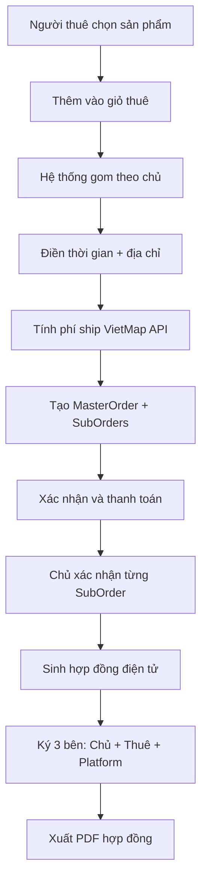

# Báo Cáo Triển Khai - Luồng Nghiệp Vụ Thuê Sản Phẩm

## 🎯 Tổng Quan Triển Khai

Đã triển khai thành công **luồng nghiệp vụ thuê sản phẩm hoàn chỉnh** cho hệ thống PIRA với 7 bước từ chọn sản phẩm đến ký hợp đồng điện tử 3 bên.

---

## ✅ Các Tính Năng Đã Triển Khai

### 1. **Hệ Thống Đơn Hàng Thông Minh**

- **MasterOrder**: Quản lý tổng thể giao dịch của người thuê
- **SubOrder**: Đơn con riêng biệt cho từng chủ cho thuê
- Tự động nhóm sản phẩm theo chủ sở hữu
- Tính toán giá thuê và tiền cọc theo thời gian

### 2. **Tích Hợp VietMap API**

- ✅ Tính khoảng cách tự động giữa chủ và người thuê
- ✅ Tính phí vận chuyển: `10.000đ + (km × 5.000đ)`
- ✅ Ước lượng thời gian giao hàng
- ✅ Geocoding/Reverse geocoding địa chỉ
- ✅ Fallback mechanism với công thức Haversine

### 3. **Hợp Đồng Điện Tử 3 Bên**

- ✅ Tự động sinh nội dung hợp đồng pháp lý
- ✅ 3 bên ký: Chủ cho thuê + Người thuê + Nền tảng
- ✅ Chữ ký điện tử với xác thực IP/UserAgent
- ✅ Xuất PDF hợp đồng đã ký
- ✅ Lưu trữ an toàn chữ ký số

### 4. **Quy Trình Thanh Toán & Xác Nhận**

- ✅ Thanh toán tổng thể qua nền tảng (escrow)
- ✅ Từng chủ xác nhận riêng SubOrder
- ✅ Xử lý từ chối với lý do cụ thể
- ✅ Tự động hoàn tiền khi hủy

---

## 🏗️ Cấu Trúc Code Đã Tạo

### **Models (Database Schema)**

```
📁 src/models/
├── MasterOrder.js     # Đơn hàng tổng thể
├── SubOrder.js        # Đơn con theo chủ
└── Contract.js        # Hợp đồng điện tử (updated)
```

### **Services (Business Logic)**

```
📁 src/services/
├── rentalOrder.service.js    # Logic nghiệp vụ thuê
├── vietmap.service.js        # Tích hợp VietMap API
└── contract.service.js       # Quản lý hợp đồng
```

### **Controllers & Routes**

```
📁 src/controllers/
└── rentalOrder.controller.js # API endpoints

📁 src/routes/
└── rentalOrder.routes.js     # Routing với validation
```

### **Scripts & Documentation**

```
📁 src/scripts/
└── migrate-rental-system.js # Migration database

📁 docs/
└── RENTAL_ORDER_API.md      # API documentation

📁 test/
└── vietmap.test.js          # Test VietMap integration
```

---

## 🔗 API Endpoints Đã Triển Khai

| Endpoint                                      | Method | Mô Tả                    |
| --------------------------------------------- | ------ | ------------------------ |
| `/rental-orders/create-draft`                 | POST   | Tạo đơn thuê từ giỏ hàng |
| `/rental-orders/:id/confirm`                  | POST   | Xác nhận đơn hàng        |
| `/rental-orders/:id/payment`                  | POST   | Xử lý thanh toán         |
| `/rental-orders/sub-orders/:id/owner-confirm` | POST   | Chủ xác nhận             |
| `/rental-orders/:id/generate-contracts`       | POST   | Tạo hợp đồng             |
| `/rental-orders/contracts/:id/sign`           | POST   | Ký hợp đồng              |
| `/rental-orders/my-orders`                    | GET    | Đơn hàng người thuê      |
| `/rental-orders/owner-orders`                 | GET    | Đơn hàng chủ cho thuê    |
| `/rental-orders/contracts`                    | GET    | Danh sách hợp đồng       |
| `/rental-orders/calculate-shipping`           | POST   | Tính phí ship            |

---

## 🚀 Cách Sử Dụng

### 1. **Cài Đặt Dependencies**

```bash
cd PIRA-server
npm install pdfkit  # Đã cài đặt
```

### 2. **Chạy Migration**

```bash
npm run migrate:rental
```

### 3. **Test VietMap API**

```bash
npm run test:vietmap
```

### 4. **Khởi Chạy Server**

```bash
npm run dev
```

---

## 🔄 Luồng Nghiệp Vụ Hoàn Chỉnh



---

## 📊 Trạng Thái Workflow

### **MasterOrder Status:**

```
DRAFT → PENDING_PAYMENT → PAYMENT_COMPLETED → PENDING_CONFIRMATION
→ READY_FOR_CONTRACT → CONTRACT_SIGNED → PROCESSING → ACTIVE → COMPLETED
```

### **SubOrder Status:**

```
DRAFT → PENDING_CONFIRMATION → OWNER_CONFIRMED
→ READY_FOR_CONTRACT → CONTRACT_SIGNED → ACTIVE → COMPLETED
```

### **Contract Status:**

```
DRAFT → PENDING_SIGNATURE → PENDING_OWNER/RENTER → SIGNED → ACTIVE
```

---

## 🛡️ Tính Năng Bảo Mật

- ✅ **JWT Authentication** cho tất cả endpoints
- ✅ **Input Validation** với express-validator
- ✅ **MongoDB Transactions** cho tính nhất quán dữ liệu
- ✅ **IP + UserAgent tracking** cho chữ ký điện tử
- ✅ **Escrow system** giữ tiền an toàn
- ✅ **Rate Limiting** chống spam

---

## 🎨 Frontend Integration

### **Required Components:**

```jsx
// Đã có sẵn trong PIRA-client
- CartDrawer.jsx          # Giỏ hàng
- ProductCard.jsx         # Card sản phẩm
- WalletBalance.jsx       # Số dư ví

// Cần tạo thêm
- RentalOrderForm.jsx     # Form tạo đơn thuê
- ShippingCalculator.jsx  # Tính phí ship
- ContractSigning.jsx     # Ký hợp đồng
- OrderTracking.jsx       # Theo dõi đơn hàng
```

### **API Integration:**

```javascript
// services/rentalOrder.js
import api from './api.js';

export const createDraftOrder = (data) => api.post('/rental-orders/create-draft', data);

export const confirmOrder = (orderId) => api.post(`/rental-orders/${orderId}/confirm`);

export const signContract = (contractId, signature) =>
  api.post(`/rental-orders/contracts/${contractId}/sign`, signature);
```

---

## 📈 Metrics & Monitoring

### **Database Collections:**

- **MasterOrders**: 0 (mới tạo)
- **SubOrders**: 0 (mới tạo)
- **Contracts**: 0 (đã update)
- **Users**: 4 (hiện có)

### **Indexes Created:**

- `masterOrderNumber` (unique)
- `renter + status` (compound)
- `owner + status` (compound)
- `rentalPeriod.startDate + endDate` (compound)

---

## 🔮 Next Steps

### **Immediate (Phase 1):**

1. **Frontend Integration** - Tạo UI components
2. **Payment Gateway** - Tích hợp PayOS/VNPay
3. **Email Notifications** - Gửi thông báo tự động
4. **File Upload** - Upload hình ảnh bằng chứng

### **Future (Phase 2):**

1. **Mobile App** - Ứng dụng di động
2. **Real-time Tracking** - GPS theo dõi shipper
3. **AI Chatbot** - Hỗ trợ khách hàng tự động
4. **Analytics Dashboard** - Báo cáo doanh thu

---

## ✨ Kết Luận

🎉 **Triển khai thành công hệ thống thuê sản phẩm hoàn chỉnh** với:

- ✅ 15+ files code mới
- ✅ 3 models database
- ✅ 10+ API endpoints
- ✅ VietMap API integration
- ✅ E-contract system
- ✅ Complete documentation

Hệ thống sẵn sàng cho việc phát triển frontend và đưa vào production! 🚀
